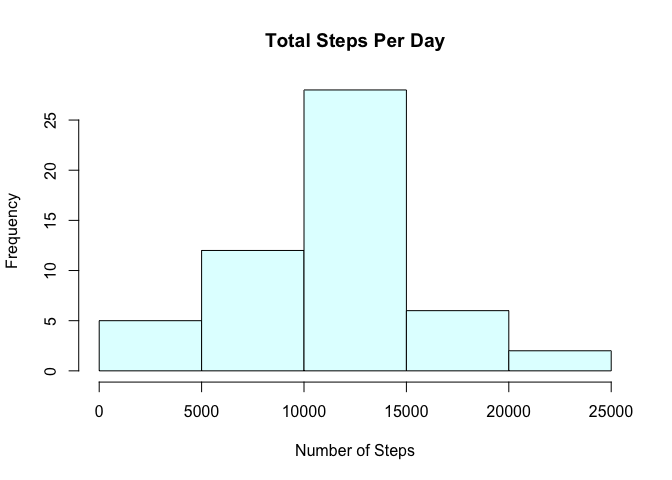
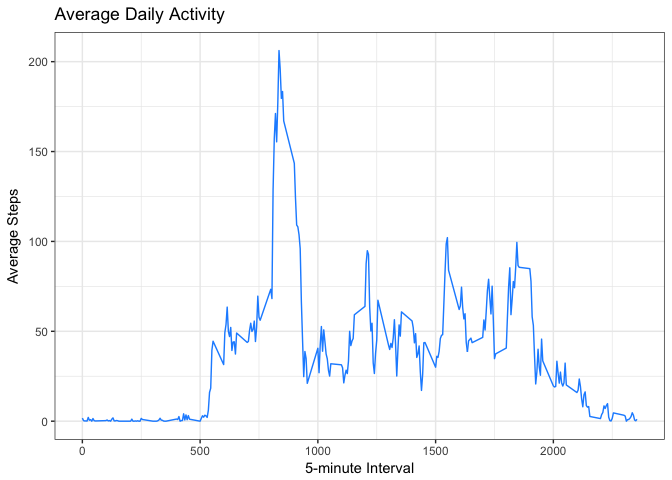
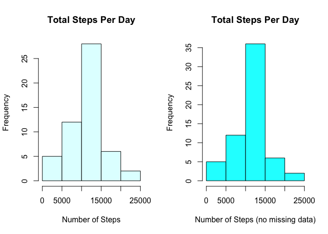
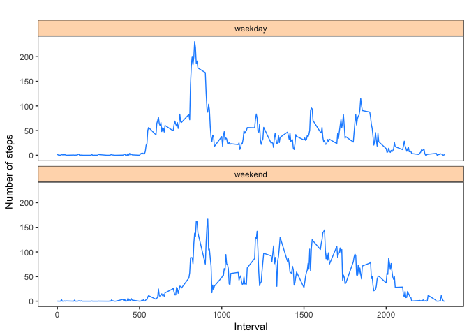

# Reproducible Research: Peer Assessment 1

This assignment answers questions using data from a personal activity monitoring device.  Code for analyzing data and generating plots is included.

First load needed libraries:

```r
# Load ggplot2
library(ggplot2)
```

## Loading and preprocessing the data
The data used for this assignment are available in this github.  To use this data:

1. Download the zip file (*activity.zip*) from this github to your R working directory.

2. Unzip the file and read it into a dataframe:


```r
# Unzip & create dataframe in working directory
unzip("activity.zip")
activity <- read.csv("activity.csv")
```

3. Preprocess the data by changing date from character to Date format.


```r
activity$date <- as.Date(activity$date)
```

## What is mean total number of steps taken per day?

For this question, it is necessary to calculate total steps per day, create a histogram of that analysis and report the mean and median of the total number of steps taken per day.  

### Calculate total steps taken per day
Use the aggregate function to calculate total steps by day.


```r
# Calculate total steps
totalsteps <- aggregate(steps ~ date, data = activity, sum)
```

### Create a Histogram

Using the base plotting system, the hist function will generate a histogram of the total number of steps taken each day.


```r
# Create histogram
hist(totalsteps$steps, main = "Total Steps Per Day", col = "lightcyan",
     xlab = "Number of Steps")
```

<!-- -->

### Calculate the mean and median of total number of steps per day

The summary function will list mean and median for the totalsteps dataframe.


```r
summary(totalsteps)
```

```
##       date                steps      
##  Min.   :2012-10-02   Min.   :   41  
##  1st Qu.:2012-10-16   1st Qu.: 8841  
##  Median :2012-10-29   Median :10765  
##  Mean   :2012-10-30   Mean   :10766  
##  3rd Qu.:2012-11-16   3rd Qu.:13294  
##  Max.   :2012-11-29   Max.   :21194
```

To answer the question, here are the required numbers:

**Median** of the total number of steps per day: 10765  

**Mean** of the total number of steps per day:  10766

## What is the average daily activity pattern?

First, determine the average daily steps using the aggregate function.


```r
# Use aggregate to determine average daily steps
meansteps <- aggregate(x=list(meansteps=activity$steps),
                   by=list(activity$interval), FUN=mean, na.rm=TRUE)

# Establish column names
colnames(meansteps) <- c("interval", "meansteps")
```

### Create a time series plot
Use ggplot2 to create a time series plot.  Note: if you did not run the library function above, do so now:


```r
# Only run this chunk if you didn't earlier
library(ggplot2)
```

Next, create the plot:


```r
g1 <- ggplot(meansteps, aes(interval, meansteps)) + 
        geom_line(color = "dodgerblue1") +
        xlab("5-minute Interval") +
        ylab("Average Steps") +
        ggtitle("Average Daily Activity") +
        theme_bw()
print(g1)
```

<!-- -->

### Which 5-minute interval contains the maximum steps?

Use the which.max function to determine which interval has the maximum steps.


```r
meansteps[which.max(meansteps$mean),]
```

```
##     interval meansteps
## 104      835  206.1698
```

The interval with the maximum steps (206) is:  *835*

## Imputing missing values

First determine how many missing values are present in the data.

### Calculate and report # of missing values


```r
# Determine the number of rows with NA values
not_ok <- activity[!complete.cases(activity),]
dim(not_ok)[1]
```

```
## [1] 2304
```

There are *2304 missing values* in the dataset.

#### Strategy
Next, determine a strategy for dealing with missing values.  Since the mean steps for 5-minute intervals have already been created, I'll use that to fill in missing values.

### Create new dataset and replace missing values 

Create a new dataframe (called *new_activity*) and then loop through the "steps" vector.  If the value is NA, data from the mean steps for 5-minute interval (*meansteps*) will be used in place of NA.  


```r
# create a new dataframe
new_activity <- activity

#loop through looking for NA values and replace those with the appropriate mean value (matching intervals)

for (i in 1:length(new_activity$steps)){
        if (is.na(new_activity$steps[i] == TRUE)){
                new_activity$steps[i] <- meansteps$mean[match(new_activity$interval[i], meansteps$interval)]
        }
}
```

### Create a Histogram with new dataset

In order to compare the two datasets, the following plot has two histograms.  The histogram on the left uses the original data and the histogram on the right uses the manipulated data (with missing values imputed).


```r
# calculate total steps by day of the imputed data
totalsteps2 <- aggregate(steps ~ date, data = new_activity, sum)

# create a one row, two column plot with two histograms
par(mfrow = c(1, 2))
hist(totalsteps$steps, main = "Total Steps Per Day", 
     col = "lightcyan",
     xlab = "Number of Steps")
hist(totalsteps2$steps, main = "Total Steps Per Day", 
     col = "cyan",
     xlab = "Number of Steps (no missing data)")
```

<!-- -->

Use summary to get mean and median numbers for the imputed dataset:


```r
summary(totalsteps2)
```

```
##       date                steps      
##  Min.   :2012-10-01   Min.   :   41  
##  1st Qu.:2012-10-16   1st Qu.: 9819  
##  Median :2012-10-31   Median :10766  
##  Mean   :2012-10-31   Mean   :10766  
##  3rd Qu.:2012-11-15   3rd Qu.:12811  
##  Max.   :2012-11-30   Max.   :21194
```

Imputed data:

* *Median* of the total number of steps per day: 10766  
* *Mean* of the total number of steps per day:  10766

Data with NAs (as a reminder from the question above):

* *Median* of the total number of steps per day: 10765  
* *Mean* of the total number of steps per day:  10766

Removing NA's seems to have had a neglible impact on the mean and median results.  However, there are differences in frequency (as seen in the y-axis scale).  

## Are there differences in activity patterns between weekdays and weekends?

During the preprocess stage (above), the date was already changed to the Date format, so the weekdays() function can be used to determine weekdays based on the date.  To see if there are differences in activity patterns between weekdays and weekends, first the weekdays/weekend values need to be added to the dataset.  This process involved several steps:

1. Use the weekdays() function to add day of the week to the dataframe.

2. Create a column (called "daytype") to store the weekend/weekday values.  Set this to the value of "weekday".

3.  Search for "Saturday" and "Sunday" in the dataframe and set their value to "weekend".  


```r
# Add a day of the week column to the dataframe
new_activity$dayofweek <- weekdays(new_activity$date, abbreviate = FALSE)

# Create a weekday column and set it to "weekday"
new_activity$daytype <- c("weekday")

# Look for "Saturday" and "Sunday" in the day of week column 
# and set the weekday value to "weekend"
for (i in 1:nrow(new_activity)) {
        if (new_activity$dayofweek[i] == "Saturday" || new_activity$dayofweek[i] == "Sunday"){
                new_activity$daytype[i] <- "weekend"
        }
}

# Convert the weekday column to a factor
new_activity$daytype <- as.factor(new_activity$daytype)
```

Next, calculate the average steps for weekends and weekdays


```r
# Calculate mean steps for weekdays and weekends
step_mean <- aggregate(steps ~ interval+daytype, new_activity, mean)
```

Use ggplot2 to create a panel plot of average steps taken by 5-minute interval, comparing weekdays vs weekends.


```r
# Create a panel plot using weekday and weekend as facets
g <- ggplot(step_mean, aes(interval, steps)) + 
        geom_line(color = "dodgerblue1") + 
        facet_wrap(~daytype, strip.position = "top", ncol = 1) +
        xlab("Interval") + ylab("Number of steps") +
        ggtitle("") +
        theme_bw() + 
        theme(panel.grid.major = element_blank(), panel.grid.minor = element_blank(), 
              strip.background = element_rect("peachpuff"))
print(g)
```

<!-- -->

## Cleaning up

Now that everything is done.  Be sure to clean-up your R workspace:


```r
rm(list = ls())
```

All done! 
